# 📊 Diagrammes et Flux - Interface Bénéficiaire

**Date** : Janvier 2025  
**Format** : Mermaid Diagrams  
**Objectif** : Visualiser les parcours utilisateurs et l'architecture

---

## 🔄 Flux Utilisateur Principal

### 1. Parcours Complet d'un Bénéficiaire

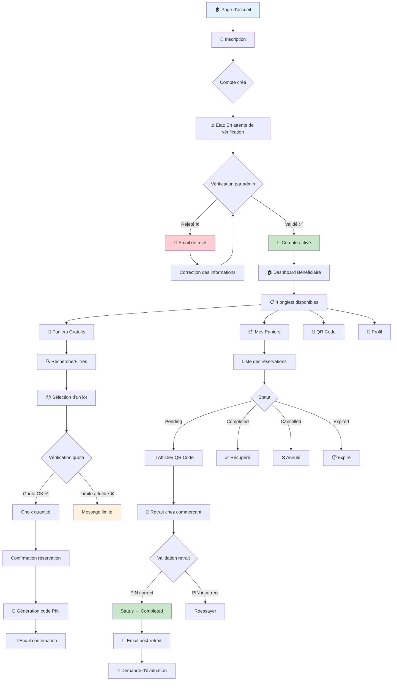

---

## 🔐 Flux de Vérification des Comptes

### 2. Processus de Vérification (Actuel vs Amélioré)

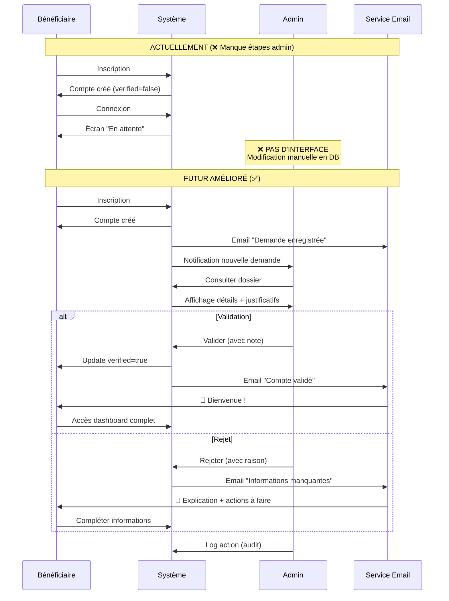

---

## 📦 Flux de Réservation

### 3. Processus de Réservation (Détaillé)

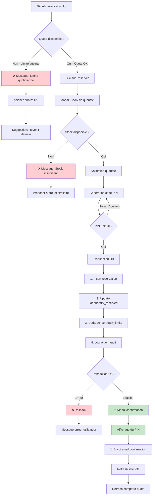

---

## 🏪 Flux de Retrait

### 4. Retrait chez le Commerçant

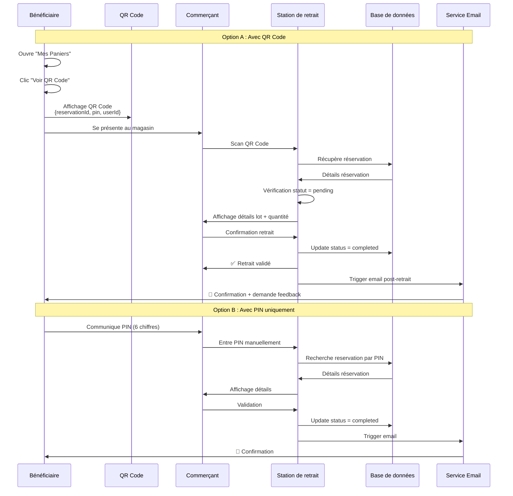

---

## ⏰ Flux de Gestion des Expirations

### 5. Auto-expiration des Réservations Non Retirées

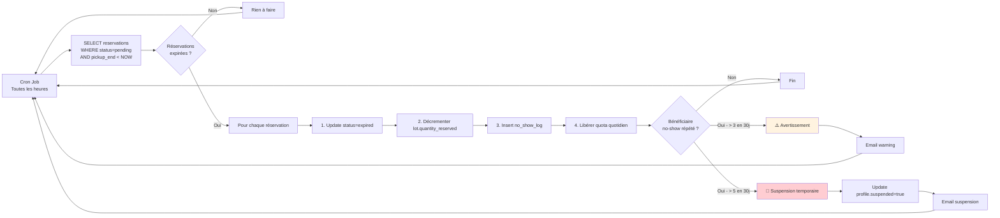

---

## 📊 Architecture de la Base de Données

### 6. Schéma Relationnel Simplifié

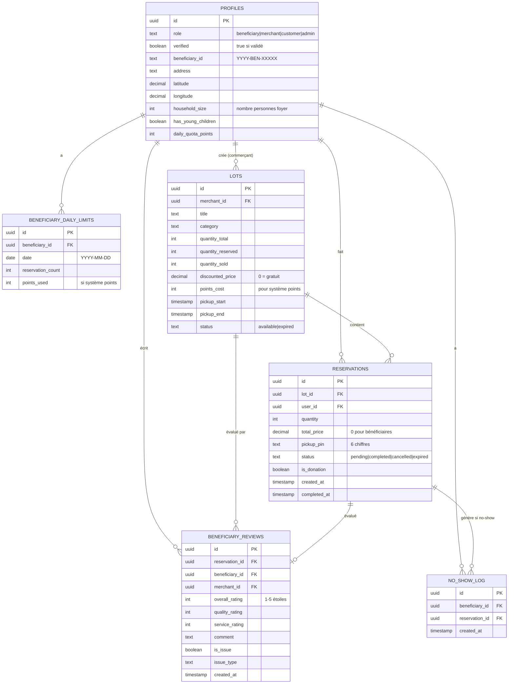

---

## 🔄 Flux de Quota Adaptatif

### 7. Système de Quota Intelligent (Futur)

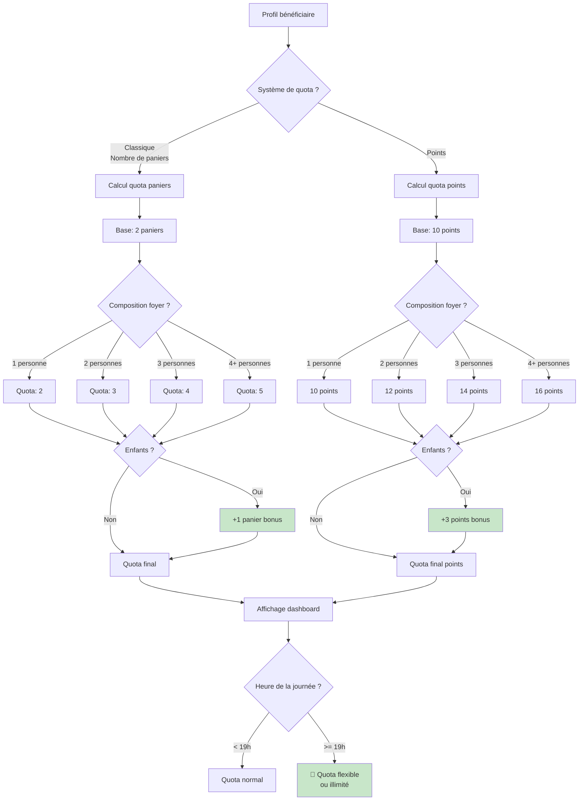

---

## 🌍 Flux de Géolocalisation

### 8. Recherche par Proximité (Futur)

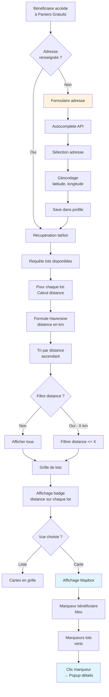

---

## 📧 Flux d'Emailing Automatisé

### 9. Système de Notifications Email (Futur)

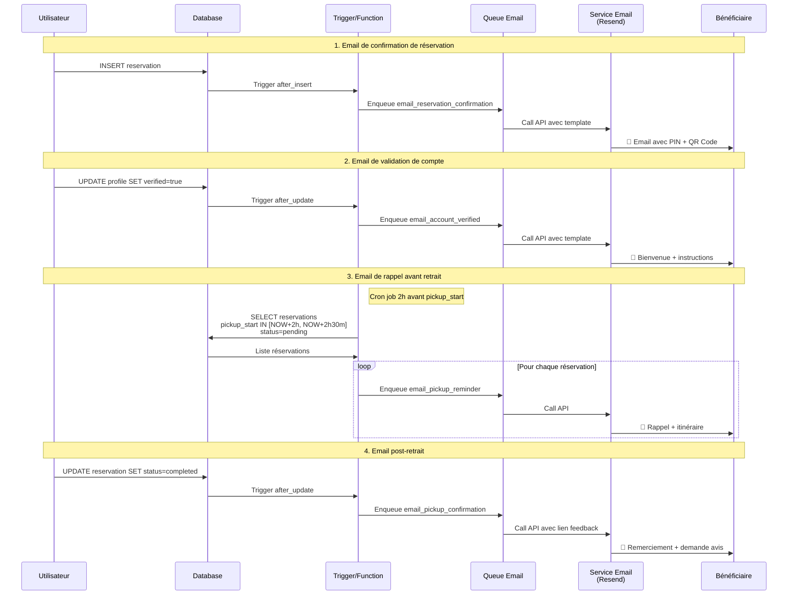

---

## 🎯 Architecture des Composants React

### 10. Organisation des Composants Bénéficiaire

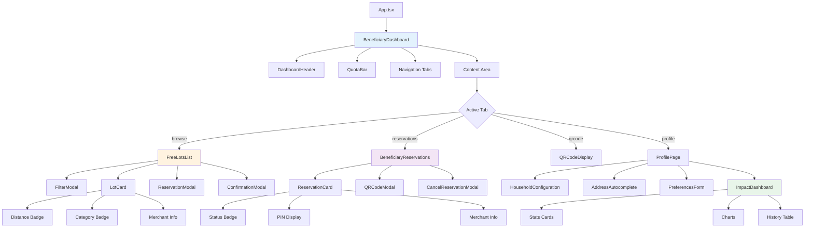

---

## 🔒 Flux de Sécurité et Validation

### 11. Vérifications de Sécurité lors de la Réservation

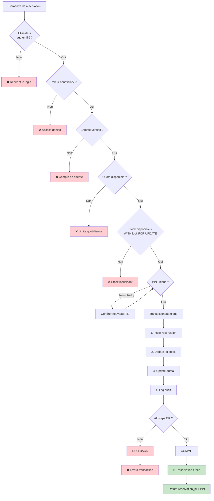

---

## 📈 Tableau de Bord d'Impact Personnel

### 12. Calcul et Affichage des Statistiques (Futur)

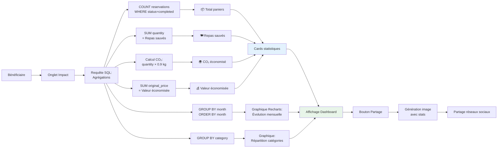

---

## 🔄 Workflow Admin de Vérification

### 13. Interface Admin - Vérification Bénéficiaires (Futur)

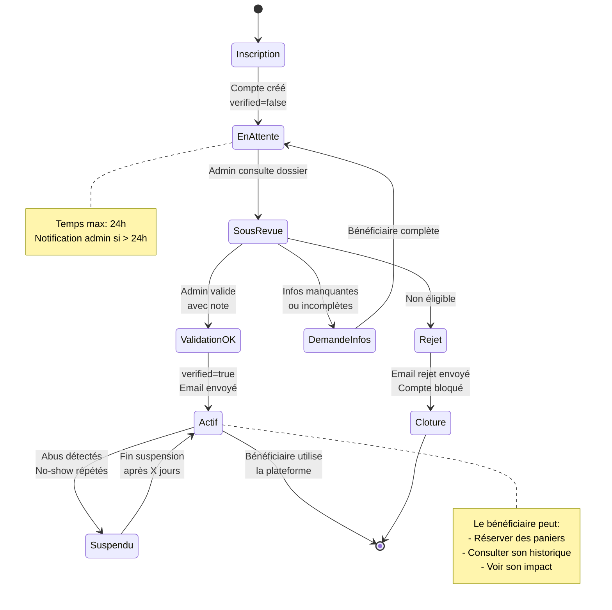

---

## 🎮 Gamification et Engagement (Futur)

### 14. Système de Badges et Récompenses

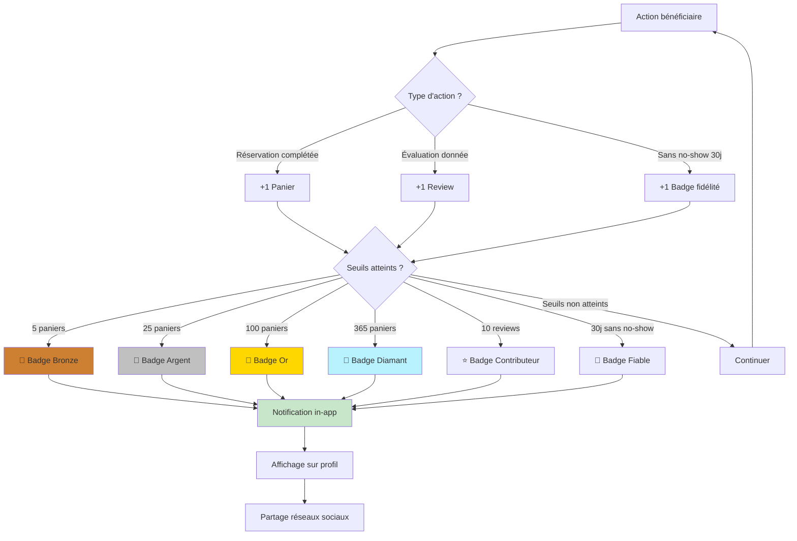

---

## 📱 Progressive Web App (PWA) - Futur

### 15. Architecture PWA et Notifications Push

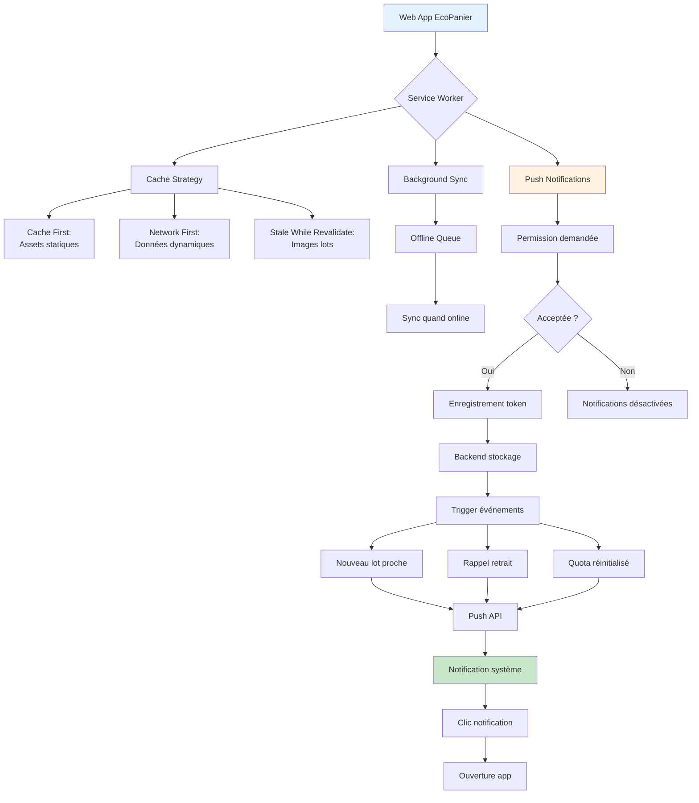

---

## 🔍 Conclusion

Ces diagrammes illustrent :

1. **Parcours utilisateurs** : De l'inscription au retrait
2. **Flux de données** : Réservations, quotas, notifications
3. **Architecture technique** : DB, composants, services
4. **Améliorations futures** : Géolocalisation, gamification, PWA

**Utilisation recommandée** :
- Présentation aux équipes techniques
- Documentation des processus
- Onboarding nouveaux développeurs
- Support à la prise de décision

---

**Tous les diagrammes sont au format Mermaid** et s'affichent automatiquement dans :
- GitHub README/Docs
- GitLab Markdown
- VS Code avec extension Mermaid
- Notion, Confluence, etc.

